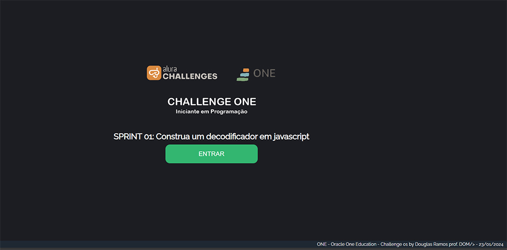
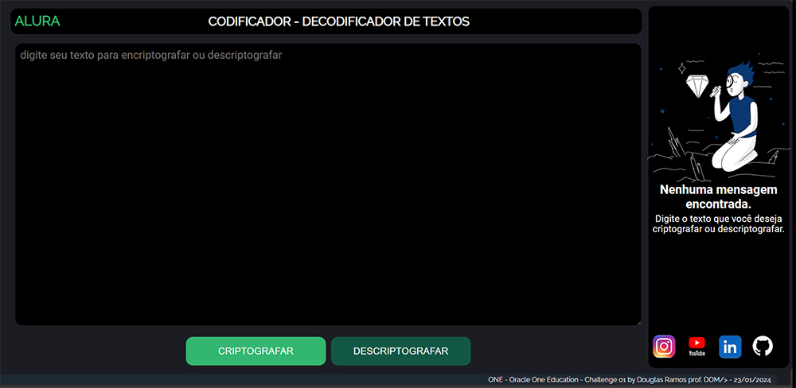

# ONE - ORACLE NEXT EDUCATION - CHALLENGE 01
SPRINT 01: Construa um decodificador em javascript

# 1 - OBJETIVOS DO CHALLENGE
Criar uma aplicação que criptografa textos, para trocar mensagens secretas, com outras pessoas que saibam o segredo da criptografia.

As "chaves" de criptografia que utilizaremos são: 
A letra "e" é convertida para "enter" 
A letra "i" é convertida para "imes" 
A letra "a" é convertida para "ai" 
A letra "o" é convertida para "ober" 
A letra "u" é convertida para "ufat"

# 2 - TELAS DA APLICAÇÃO

    
    

# 3 - REQUISITOS

    <ol>
      <li>Deve funcionar apenas com letras minúsculas</li>
      <li>Não devem ser utilizados letras com acentos nem caracteres especiais</li>
      <li>Deve ser possível converter uma palavra para a versão criptografada e também retornar uma palavra criptografada para a versão original</li>
    </ol>

# 4 - EXTRAS

    <ol>
      <li>Um botão que copie o texto criptografado/descriptografado para a área de transferência - ou seja, que tenha a mesma funcionalidade do ctrl+C ou da opção "copiar" do menu dos aplicativos</li>
    </ol>

