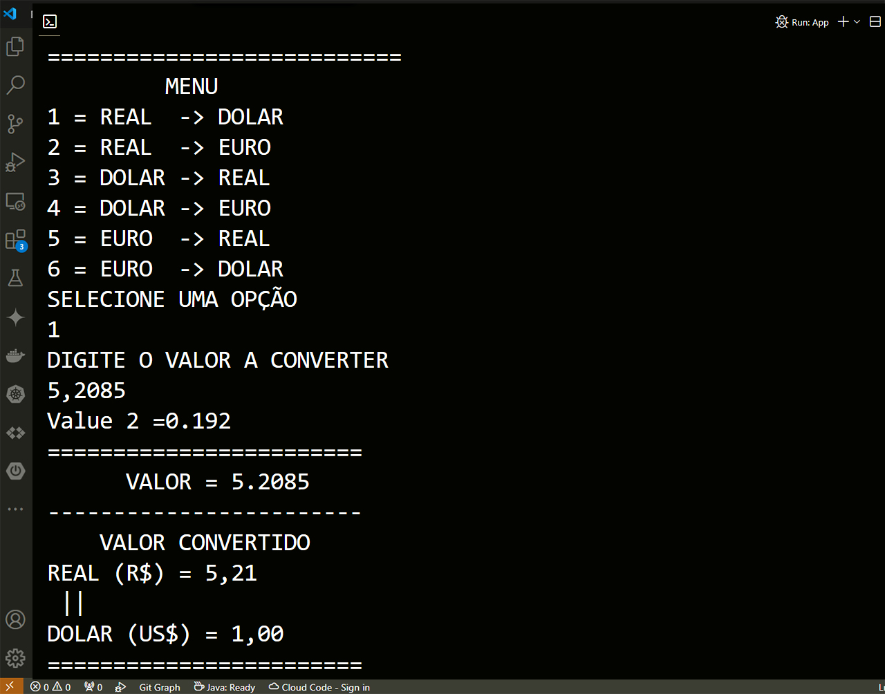
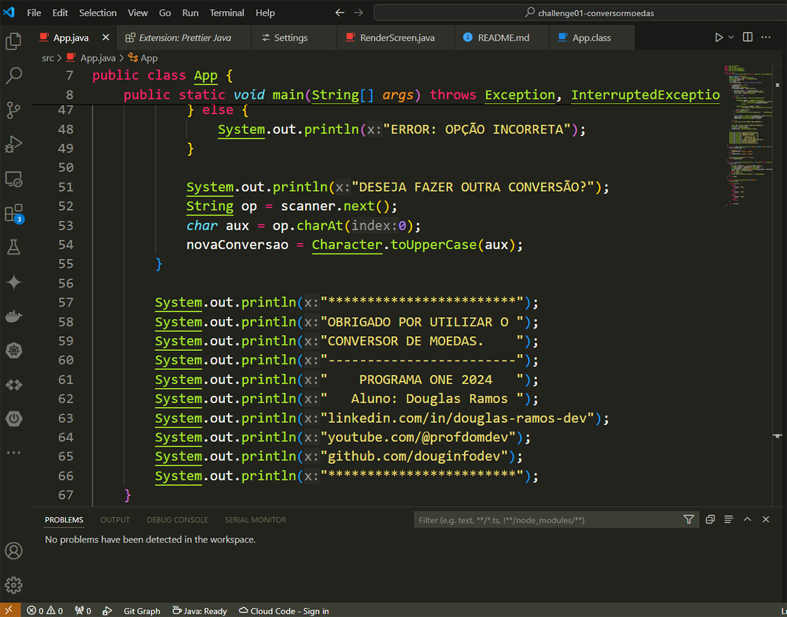

# PROGRAMA ONE - TRILHA BACK-END
## CHALLENGE 01 - CONVERSOR DE MOEDAS 

OBJETIVO: Construir un conversor de moedas em Java, que consuma uma API externa gratuita com os valores atuais das cotações de moedas.

## Conversor de Moedas - Aluno Douglas Ramos
### Tela do Projeto

 

### Código do Projeto

 

