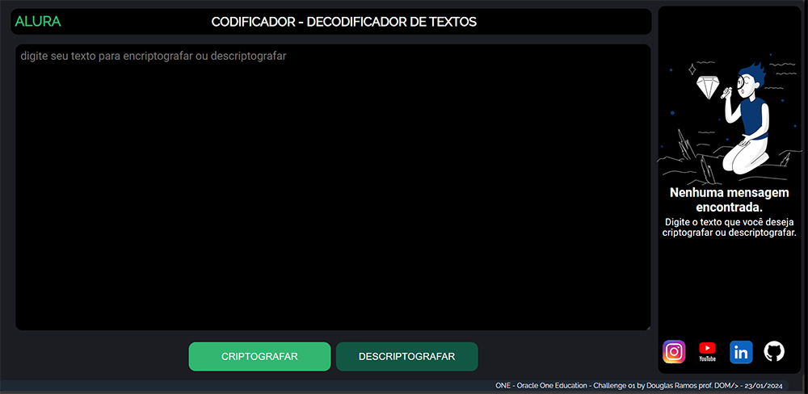

# ONE - ORACLE NEXT EDUCATION - CHALLENGE 01
SPRINT 01: Construa um decodificador em javascript

# OBJETIVOS Do CHALLENGE
Criar uma aplicação que criptografa textos, para trocar mensagens secretas, com outras pessoas que saibam o segredo da criptografia.

As "chaves" de criptografia que utilizaremos são:
A letra "e" é convertida para "enter"
A letra "i" é convertida para "imes"
A letra "a" é convertida para "ai"
A letra "o" é convertida para "ober"
A letra "u" é convertida para "ufat"

# TELAS DA APLICAÇÃO

    
    

